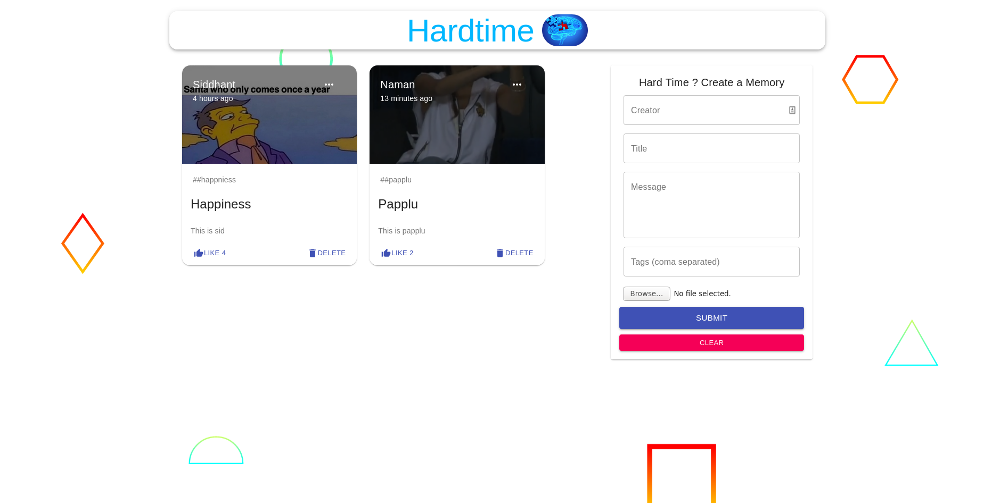

<p align="center">

</p>

[](https://github.com/nightwarriorftw/hardtime/issues) [](https://github.com/nightwarriorftw/hardtime/network/members) [](https://github.com/nightwarriorftw/hardtime/stargazers) [](http://ForTheBadge.com)   [](https://twitter.com/intent/follow?screen_name=nightwarriorftw) [](https://telegram.me/nightwarriorftw)


# [hardtime](https://hardtime.netlify.app/) - Create Happy Memories and Snaps

## :ledger: Index

- [About](#beginner-about)
- [Usage](#zap-usage)
  - [Commands](#package-commands)
- [Development](#wrench-development)
  - [Pre-Requisites](#notebook-pre-requisites)
  - [Development Environment](#nut_and_bolt-development-environment)
- [Gallery](#camera-gallery)
- [Credit/Acknowledgment](#star2-creditacknowledgment)
- [License](#lock-license)

## :beginner: About

A application is built using **React**, **Nodejs**, **MongoDB** and **Express** where people can create memories and watch them during there hard times.

## :zap: Usage

- Future is uncertain. Everyone can have hardtime. Here is a solution to this problem. It will make you feel better.
- This is a simple MERN stack application which allows people to share memories, interesting events and snaps that happened with them and can later view it during there hard times.
- You can like the posts share by other people and delete the posts as well. It's public since the more positive atmosphere around us, the more better one will feel.

## :wrench: Development

### :notebook: Pre-Requisites

Knowledge of React, NodeJS, MongoDB and Express.

### :nut_and_bolt: Development Environment

- Backend

There backend API is hosted [here](https://hardtime.herokuapp.com)

#### 1. Clone the repo and install requirements

```
git clone https://github.com/nightwarriorftw/hardtime.git
cd hardtime/server
npm install
```

#### 2. Run server

```
npm start
```

- frontend

The frontend part is hosted [here](https://hardtime.netlify.app/)

#### 1. Move to the client folder and install requirements

```
cd hardtime/client
npm install
```

#### 2. Run the server

```
npm start
```

## :camera: Gallery

- Front Page
  

## :star2: Credit/Acknowledgment
- Github [nightwarriorftw](https://github.com/nightwarriorftw)
- Linkedin [LinkedIn](https://linkedin.com/in/developer-aman-verma)
- Twitter [Twitter](https://twitter.com/twitter.com)

Credits goes to me 
## :lock: License

[LICENSE](/LICENSE)
